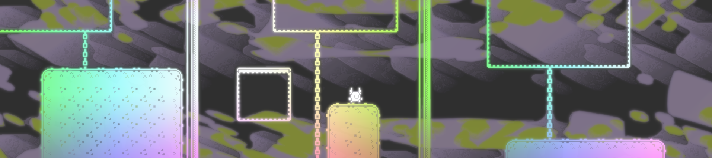
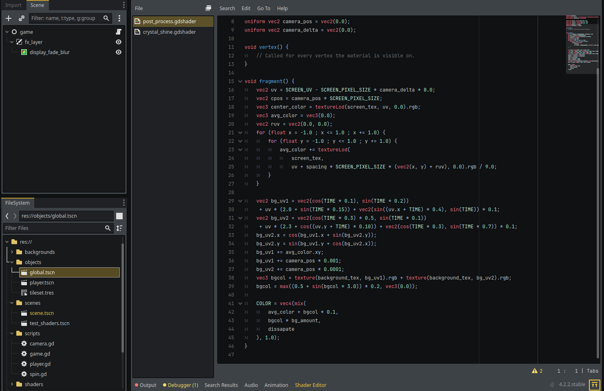

this project is an example of using feedback to create visual effects in Godot 4

the setup is easy in Godot 4, all that is needed is a canvas layer and a color rect. the shader reads the screen texture and writes to the current buffer. internally, godot uses a double buffer.

this particular shader produces a glow / fade effect.